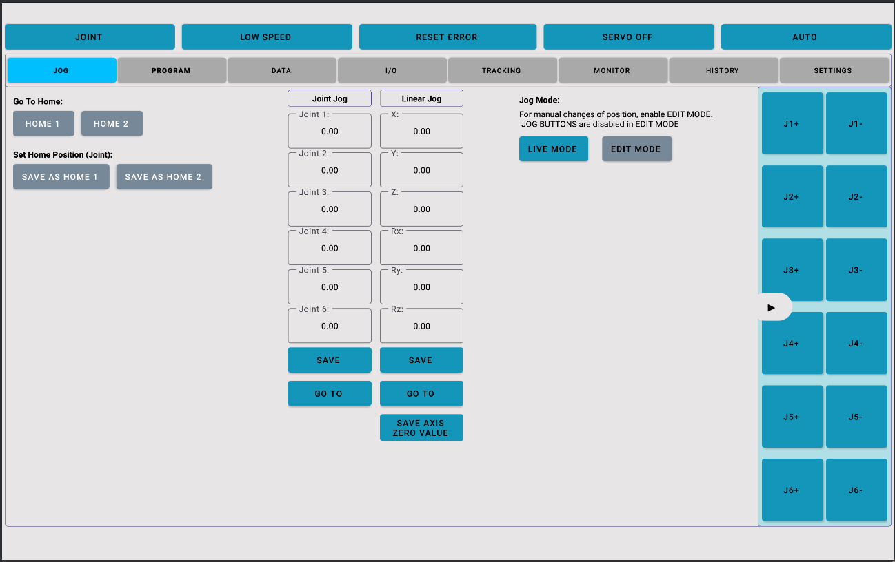
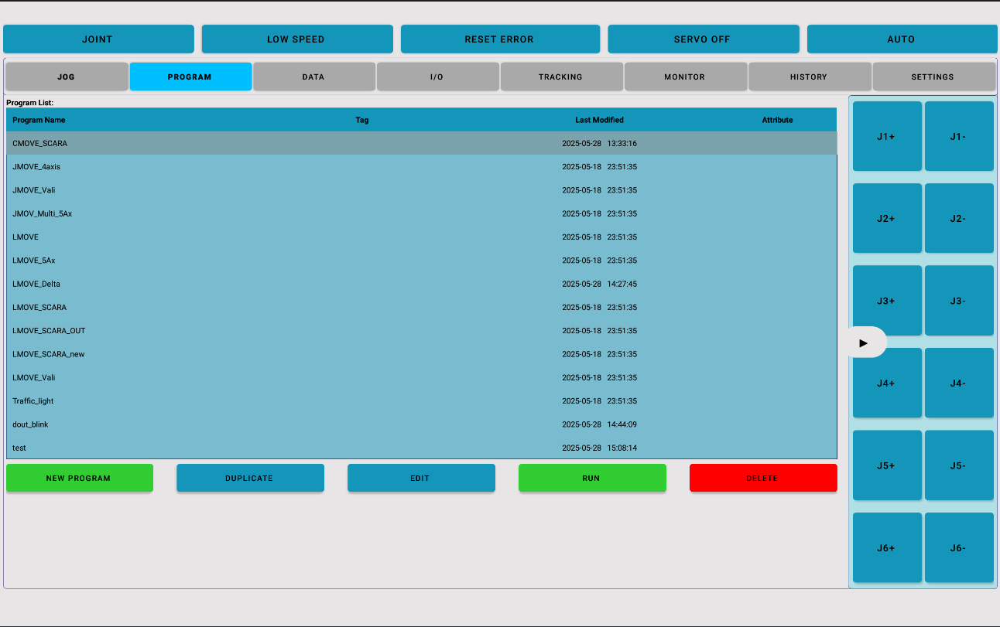
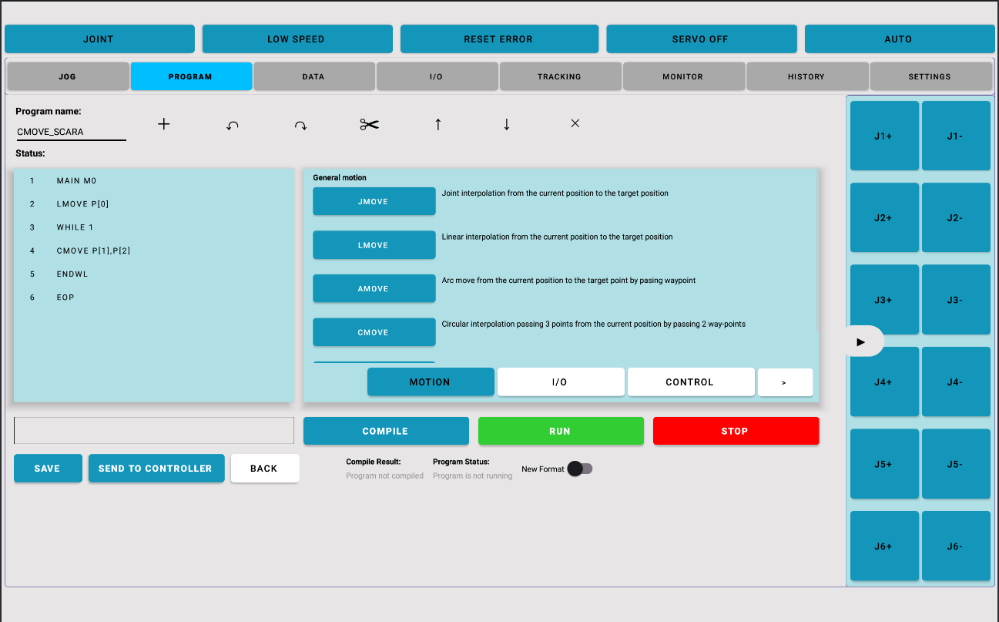

# android-wireless-robot-control

An Android application that replicates the core functionality of traditional industrial robot teach pendants — with added flexibility, wireless communication, and modern UI — enabling scalable, low-cost deployment and easy updates.

## Overview

This project aims to modernize robot control systems by leveraging the Android ecosystem. Designed as a teach pendant alternative, the app includes all essential features found in conventional robot controllers, while adding:

- **Wireless communication** over **TCP/IP** and **Bluetooth**
- **Customizable interface** and behavior via Android platform
- **Scalable** deployment and update process through standard Android distribution

## Features

- Dual-channel communication (TCP/IP + Bluetooth)
- Jogging and coordinate control
- Program editing and execution
- Local data storage with SQLite
- Responsive UI using Material Design
- Designed for touch-based control tablets and phones

## Tech Stack

- **Language:** Java
- **Database:** SQLite
- **UI:** Android XML with Material Design Components
- **IDE:** Android Studio

## Testing

Manual testing is currently used to verify key robot control flows, connectivity, and error handling.

## 📸 Screenshots

| Jog | Program List | Program Edit | Settings |
|------|--------------|--------------|----------|
|  |  |  |  |

## Getting Started

### Prerequisites

- Android Studio Giraffe or later
- Gradle 8+
- Android SDK 24+
- Physical or emulated Android device (tablet with Android 7.0 and above is preferable)
- May require extra Android permissions in use

### Installation

1. Clone the repo:
   ```bash
   git clone https://github.com/huyle-auto/android-wireless-robot-control.git
2. Open project in Android Studio
3. Sync Gradle and Run
   
### Author 

Developed by huyle-auto

## Notes

This application is made specifically for VAS Robot Controller - LCXMC. While it may not work directly on Robot from other brands, you can utilize it for quick testing TCP/IP and classic Bluetooth communication (single connection per method).

